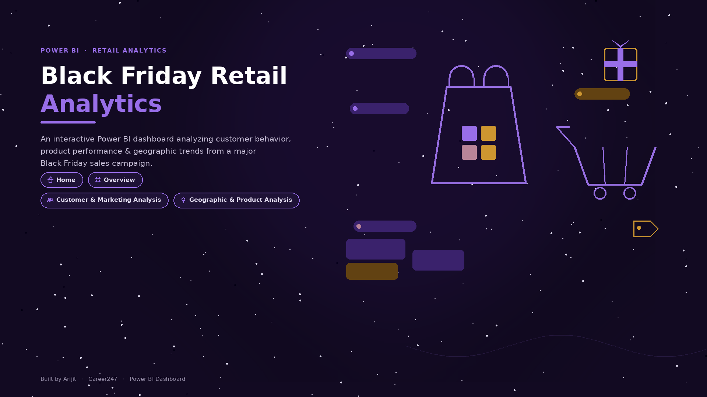
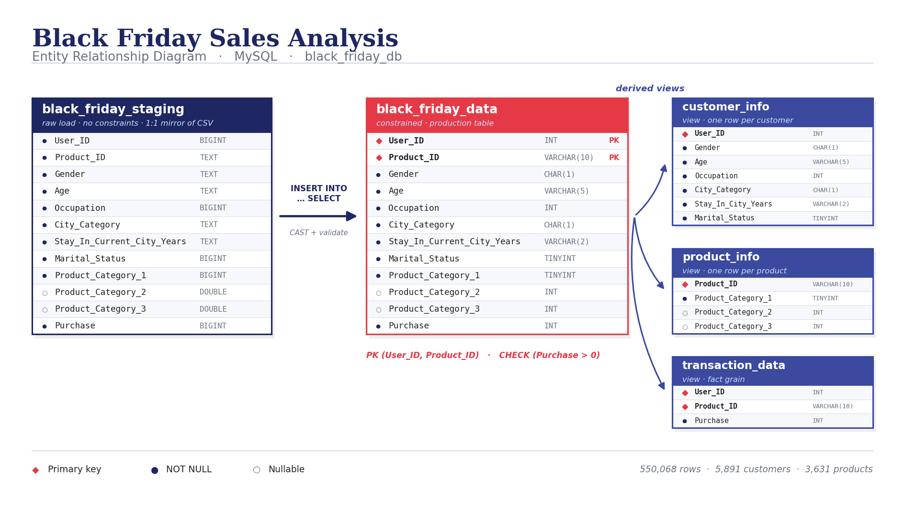
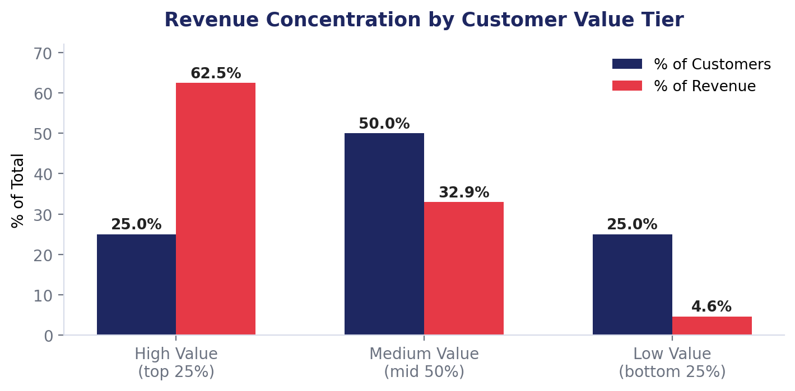
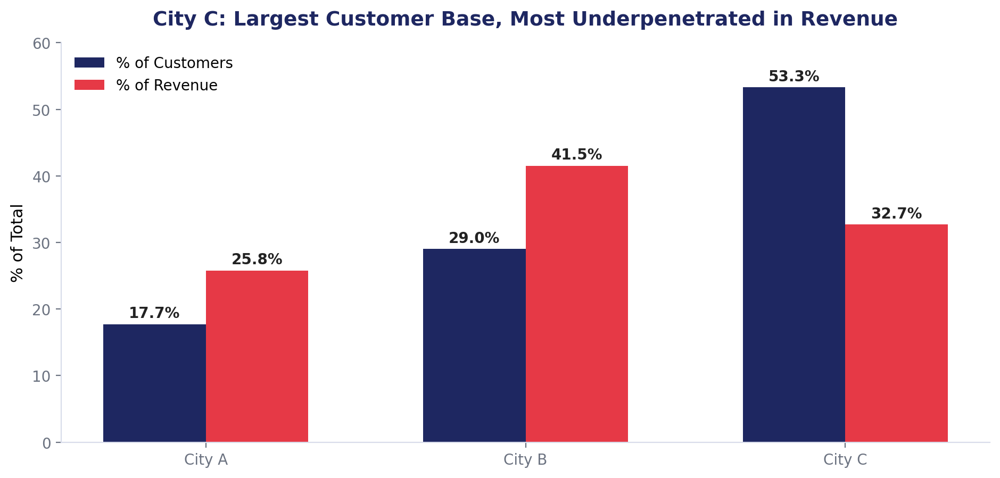
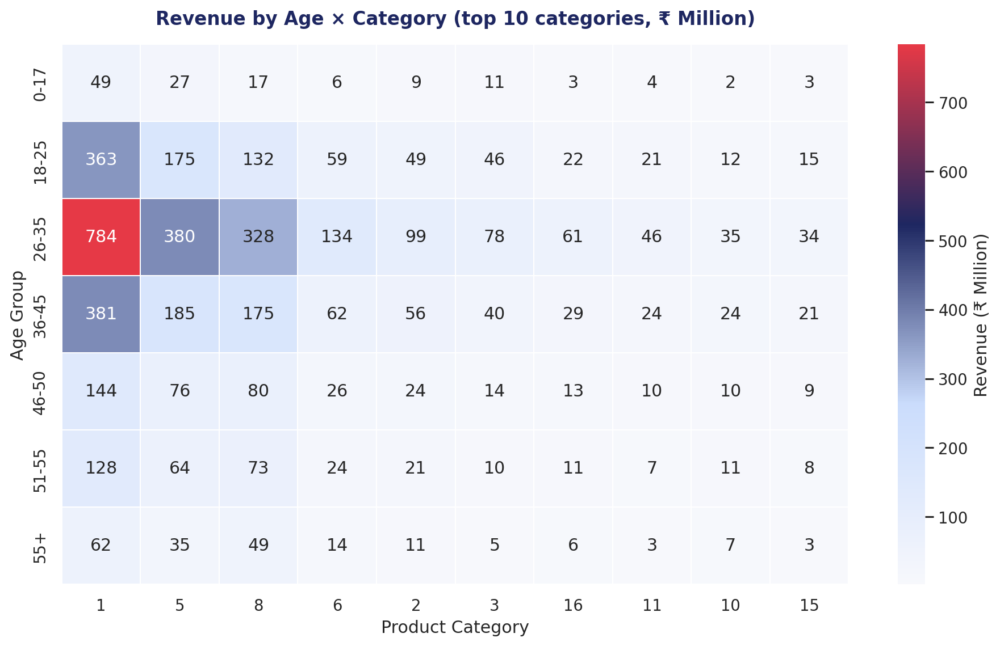
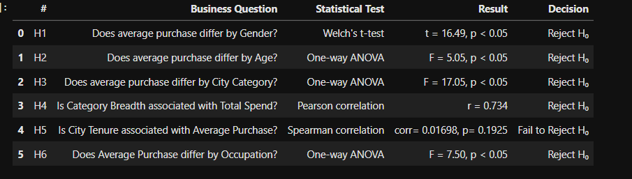
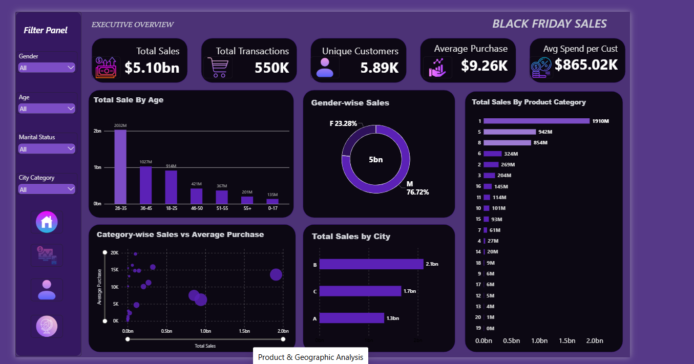
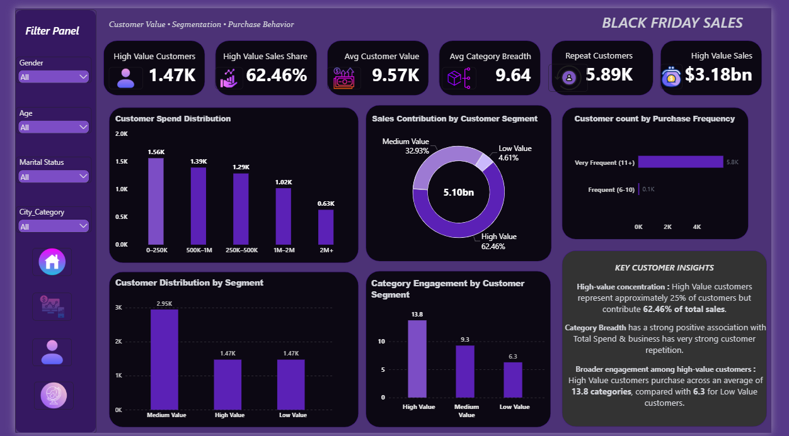
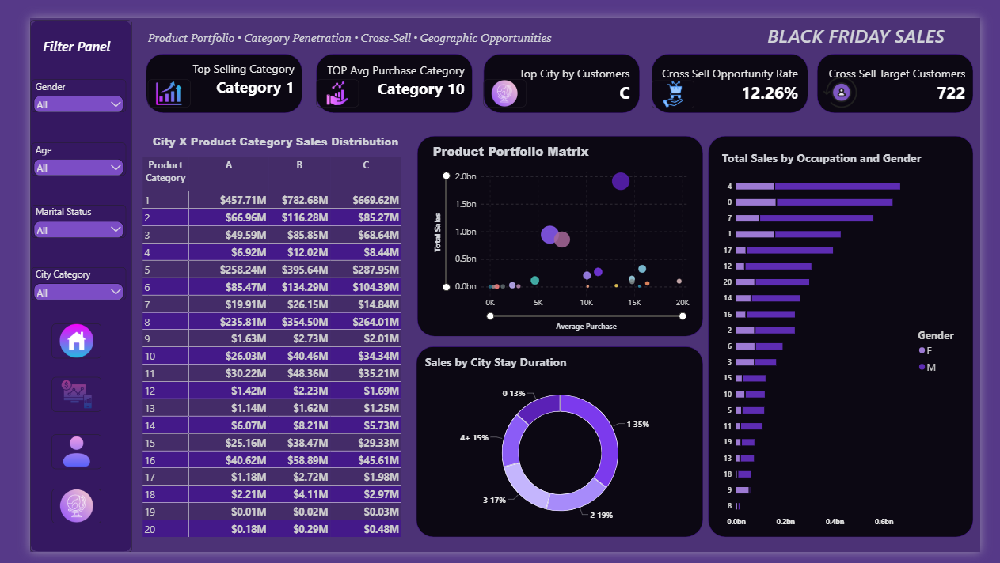

# Black Friday Sales Analysis

**An end-to-end retail analytics project** — from raw CSV to a validated SQL data model, statistical hypothesis testing, an interactive Power BI dashboard, and a stakeholder-ready set of strategic recommendations.




---

## Table of Contents

- [Business Problem](#business-problem)
- [Dataset](#dataset)
- [Tech Stack](#tech-stack)
- [Project Architecture](#project-architecture)
- [Analysis Workflow](#analysis-workflow)
- [Key Findings](#key-findings)
- [Statistical Validation](#statistical-validation)
- [Dashboard](#dashboard)
- [Strategic Recommendations](#strategic-recommendations)
- [Assumptions & Limitations](#assumptions--limitations)
- [Repository Structure](#repository-structure)
- [Setup](#setup)

---

## Business Problem

Black Friday drives peak transaction volume across a retailer's physical and online channels. With that scale comes complexity: customer behavior fragments across demographics, product demand spikes unevenly, and marketing spend becomes hard to justify.

Leadership needed answers to four questions:

1. Which customer segments contribute the most — and which are underpenetrated?
2. How do demographics and lifestyle attributes influence purchase size and category mix?
3. Which product categories dominate, and where are the cross-sell opportunities?
4. How do we retain high-value customers beyond Black Friday?

---

## Dataset

| Metric | Value |
|---|---|
| Transactions | 550,068 |
| Unique customers | 5,891 |
| Unique products | 3,631 |
| Total sales | $5,095,812,742 (~$5.10bn) |
| Average purchase | $9,263.97 |
| Median purchase | $8,047.00 |
| Purchase range | $12 – $23,961 |
| Fields | 12 (demographics, product categories, purchase amount) |

---

## Tech Stack

| Tool | Application |
|---|---|
| **Excel** | Initial data validation, conditional formatting, data quality log |
| **MySQL** | Schema design, constraints, staging → production migration, dimension views |
| **Python** | `pandas`, `matplotlib`, `seaborn`, `scipy.stats`, `statsmodels` |
| **SQLAlchemy + PyMySQL** | Python ↔ MySQL pipeline |
| **Power BI** | 4-page interactive dashboard with cross-page navigation |

---

## Project Architecture

Data flows from a raw CSV into an unconstrained staging table, then migrates into a fully constrained production table, which in turn feeds three dimension-like views.



**Design decisions:**

- **Staging-first load** — the CSV lands in `black_friday_staging` with no constraints, so a malformed row fails at migration (where it's debuggable) rather than at import.
- **Composite primary key** `(User_ID, Product_ID)` — verified as unique across all 550,068 rows before being applied.
- **`CHECK (Purchase > 0)`** — validated against the data first (minimum purchase is ₹12, so no rows are rejected).
- **Three views** rather than physical dimension tables — every `User_ID` maps to exactly one demographic profile and every `Product_ID` to one category combination, so `SELECT DISTINCT` is provably safe here.

---

## Analysis Workflow

| Phase | Output |
|---|---|
| 1. Business Understanding | BRD & KPI framework ([`docs/`](docs/)) |
| 2. Data Validation | Excel validation, data quality log |
| 3. SQL Modeling | DDL, migration, views ([`sql/`](sql/)) |
| 4. EDA | Distribution, outliers, category/city/demographic contribution |
| 5. Segmentation | Value tiers, category breadth, cross-sell affinity |
| 6. Statistical Testing | T-tests, ANOVA, correlation |
| 7. Dashboarding | 4-page Power BI report |
| 8. Recommendations | Executive summary & stakeholder deck |

---

## Key Findings

### 1. Revenue is concentrated in a small High-Value segment

The top 25% of customers by total spend generate **62.46% of all revenue**, while the bottom 25% contribute just 4.61%.



### 2. Sales are concentrated in a handful of categories

**Category 1 alone drives 37.5%** of total revenue. The top 5 of 20 categories account for **84.5% of all sales**.

### 3. City C is the largest customer base but the most underpenetrated market

City C holds **53.3% of all customers** but generates only **32.7% of revenue** — the largest volume-to-value gap in the business.



### 4. Category breadth is the strongest behavioral driver of spend

Category breadth correlates strongly with total spend (**r = 0.734**). High-Value customers purchase across **13.8 categories** on average, versus **6.3** for Low-Value customers.

### 5. The core customer base is demographically concentrated

Male customers drive **76.72%** of revenue; the 26–35 age group contributes **39.87%** of revenue from 34.8% of customers.



> **On outliers:** 0.49% of transactions (2,677 rows) exceed the IQR upper bound of $21,400 — but a z-score test (`|z| > 3`) flags **zero** rows, and 85% of the flagged rows belong to a single premium category where they represent 44% of its volume. These were **retained and flagged** as a high-value indicator, not removed as errors.

---

## Statistical Validation

All business assumptions were tested rather than asserted (α = 0.05):



| Business Question | Test | Result | Decision |
|---|---|---|---|
| Purchase differs by Gender? | Welch's t-test | t = 16.49, p < 0.05 | Reject H₀ |
| Purchase differs by Age? | One-way ANOVA | F = 5.05, p < 0.05 | Reject H₀ |
| Purchase differs by City Category? | One-way ANOVA | F = 17.05, p < 0.05 | Reject H₀ |
| Category Breadth ↔ Total Spend? | Pearson correlation | r = 0.734 | Reject H₀ |
| City Tenure ↔ Average Purchase? | Spearman correlation | corr = 0.017, p = 0.1925 | **Fail to reject H₀** |
| Purchase differs by Occupation? | One-way ANOVA | F = 7.50, p < 0.05 | Reject H₀ |

**The negative result matters most here.** City tenure shows *no* significant relationship with spending, so it was explicitly excluded from targeting logic — a reminder that a variable being available is not the same as it being useful.

---

## Dashboard

A 4-page Power BI report with a shared filter panel (Gender, Age, Marital Status, City Category) and cross-page navigation.

**Executive Overview** — headline KPIs, sales by age, gender split, category and city performance


**Customer & Marketing Analysis** — value tiers, spend distribution, category engagement, purchase frequency


**Product & Geographic Analysis** — portfolio matrix, city × category distribution, cross-sell opportunity


---

## Strategic Recommendations

| # | Recommendation | Evidence | Expected Impact | Priority |
|---|---|---|---|---|
| 1 | High-Value retention & loyalty program | 25% of customers → 62.46% of revenue | Protects the majority of revenue | 🔴 High |
| 2 | City C activation (frequency-led, not discount-led) | 53.3% of customers, 32.7% of revenue | Largest headroom in the business | 🔴 High |
| 3 | Cross-sell program anchored on category breadth | r = 0.734; 13.8 vs 6.3 categories | Directly moves customers up-tier | 🔴 High |
| 4 | Diversify beyond the core demographic | 76.72% of revenue from one gender | Reduces concentration risk | 🟠 Medium |
| 5 | Exclude city tenure from targeting logic | p = 0.1925 (not significant) | Prevents ineffective segmentation | 🟢 Low |

Full reasoning in [`docs/Executive_Summary.docx`](docs/).

---

## Assumptions & Limitations

Stated plainly, because they affect how the results should be read:

- **"CLV" is not lifetime value.** The BRD defines it as `Total Spend / Transaction Count`, which is the textbook formula for **Average Order Value**. Without a date field, a true time-based CLV (frequency × lifespan × margin) cannot be computed from this dataset. The metric is reported as AOV.
- **Transactions are line items, not shopping trips.** There is no order or checkout date, so each row is a product line item. Every customer has at least 6 rows (median 54, max 1,026) — which means a literal "repeat purchase rate" is ~100% and not meaningful here. Frequency bands are used instead.
- **Revenue ≠ profit.** No cost or margin data is available, so "high-value" means high-revenue, not high-margin.
- **ANOVA identifies that groups differ, not which ones.** Post-hoc testing (e.g. Tukey HSD) would be required to isolate specific group differences.
- **Product categories are masked.** Categories are numeric codes with no business labels, limiting how specific the merchandising recommendations can be.
- **Cross-sell findings are correlational.** Category breadth correlates with spend; this does not establish that increasing breadth *causes* higher spend. Framed as a testable opportunity, not a proven lever.

---

## Repository Structure

```
black-friday-sales-analysis/
├── README.md
├── requirements.txt
├── .gitignore
├── .env.example
│
├── docs/
│   ├── BRD_Black_Friday_Sales_Analysis.pptx
│   ├── Stakeholder_Presentation.pptx
│   ├── Executive_Summary.docx
│   └── er_diagram.png
│
├── data/
│   ├── raw/                 # original CSV — never edited in place
│   └── processed/           # cleaned / feature-engineered exports
│
├── sql/
│   ├── ddl/
│   │   ├── 01_create_staging.sql
│   │   ├── 02_create_black_friday_data.sql
│   │   └── 03_create_views.sql
│   ├── migration/
│   │   └── staging_to_final.sql
│   └── queries/
│       └── exploratory_queries.sql
│
├── notebooks/
│   └── Black_Friday_EDA_Statistical_Analysis.ipynb
│
├── dashboards/
│   └── Black-Friday-Visualisation.pbix
│
└── assets/                  # images used in this README
```

---

## Setup

```bash
git clone <repo-url>
cd black-friday-sales-analysis

python -m venv venv
venv\Scripts\activate          # Windows
# source venv/bin/activate     # macOS / Linux

pip install -r requirements.txt
cp .env.example .env           # then fill in your DB credentials
```

**Database setup** — run the SQL scripts in order:
create sql databse
```bash
# load the CSV into staging via the notebook's ingestion cell
mysql -u root -p < sql/ddl/02_create_black_friday_data.sql
mysql -u root -p < sql/migration/staging_to_final.sql
mysql -u root -p < sql/ddl/03_create_views.sql
```


## Author

**Arijit** — transitioning from customer support into Data & Business Analytics.

Built with MySQL, Python, and Power BI as part of the Career247 *Data Analytics with GenAI* capstone.
